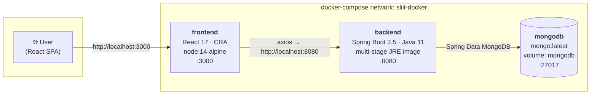
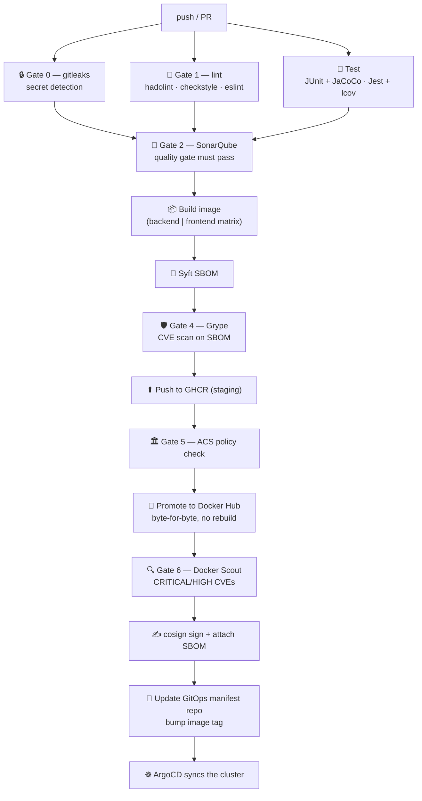

<div align="center">

# opsera-mid_project

**A containerised 3-tier student management app with a fully automated DevSecOps pipeline.**

React UI → Spring Boot REST API → MongoDB, built, scanned, signed and released
through 7 security gates on every push.

[](https://github.com/mhmdmstfa2010/opsera-mid_project/actions/workflows/devsecops.yml)


</div>

---

## Table of contents

- [Overview](#overview)
- [Architecture](#architecture)
- [Tech stack](#tech-stack)
- [Quick start](#quick-start)
- [API reference](#api-reference)
- [Frontend routes](#frontend-routes)
- [Testing & coverage](#testing--coverage)
- [CI/CD — DevSecOps pipeline](#cicd--devsecops-pipeline)
- [Required GitHub secrets](#required-github-secrets)
- [Signed images & supply-chain verification](#signed-images--supply-chain-verification)
- [Troubleshooting](#troubleshooting)
- [License](#license)

---

## Overview

A REST API and single-page UI for managing student records (register, log in,
view, update, delete), packaged as Docker images and released through a
security-first pipeline:

- **Every push** is scanned for secrets, linted, unit-tested and analysed by
  SonarQube **before** any image is built.
- Images are scanned twice (Grype + Docker Scout) with an SBOM generated by
  Syft, checked against an ACS policy, promoted byte-for-byte between
  registries (no rebuilds), then **signed with cosign**.
- A GitOps job bumps the image tag in a separate manifest repo; **ArgoCD**
  detects the change and syncs the cluster — CI never touches the cluster.

---

## Architecture

### Runtime



| Service     | Port (host → container)  | Role                                   |
| ----------- | ------------------------ | -------------------------------------- |
| `frontend`  | `3000 → 3000`            | React SPA (Create React App)           |
| `backend`   | `8080 → 8080`            | REST API (`/student/**`)               |
| `mongodb`   | `21017 → 27017`          | Document store (`mydb`)                |

> The backend resolves the DB as hostname `mongodb` (Compose network alias),
> not `localhost`. Outside Compose, uncomment the `spring.data.mongodb.uri`
> line in `backend/src/main/resources/application.properties`.

### Repository layout

```
opsera-mid_project/
├── .github/workflows/devsecops.yml   # the 7-gate DevSecOps pipeline
├── backend/                          # Spring Boot REST API
│   ├── Dockerfile                    # multi-stage: maven build → JRE runtime
│   ├── pom.xml                       # JaCoCo + Checkstyle plugins
│   └── src/main/java/.../studentservice/
│       ├── controller/StudentRestController.java
│       ├── service/ + service/impl/
│       ├── repository/StudentRepository.java
│       └── entity/Student.java, LoginRequest.java
├── frontend/                         # React SPA
│   ├── Dockerfile
│   ├── package.json                  # lint / test scripts
│   └── src/
│       ├── App.js                    # routes
│       ├── api/students_api.js       # axios client
│       └── components/               # home, navbar, student + staff views
├── docker-compose.yml                # mongodb + backend + frontend
├── cosign.pub                        # public key to verify signed images
└── LICENSE                           # MIT
```

---

## Tech stack

| Layer     | Technology |
| --------- | ---------- |
| Frontend  | React 17, React Router 6, React Bootstrap, Axios, react-toastify |
| Backend   | Java 11, Spring Boot 2.5 (Web, Data MongoDB, Lombok), Maven (`./mvnw`) |
| Database  | MongoDB (`mydb`) |
| Packaging | Docker multi-stage builds, Docker Compose |
| Quality   | SonarQube, JaCoCo, Checkstyle (Google style), ESLint, Hadolint, gitleaks |
| Supply chain | Syft SBOM, Grype, Docker Scout, ACS (roxctl), cosign signing |
| Delivery  | GHCR → Docker Hub promotion, GitOps manifest repo, ArgoCD |

---

## Quick start

### Prerequisites

- Docker + Docker Compose
- (local dev only) JDK 11+ and Node 18+

### 1. Docker Compose — recommended

```bash
git clone https://github.com/mhmdmstfa2010/opsera-mid_project.git
cd opsera-mid_project
docker compose up --build
```

| Service    | URL                              |
| ---------- | -------------------------------- |
| Frontend   | http://localhost:3000            |
| API        | http://localhost:8080/student/all |
| MongoDB    | `mongodb://localhost:21017/mydb` |

Stop everything: `docker compose down` (add `-v` to drop the DB volume).

### 2. Build the images yourself

```bash
docker build -t student-service backend/
docker build -t student-ui   frontend/
```

### 3. Run the backend without Docker

```bash
cd backend
./mvnw spring-boot:run     # needs a reachable MongoDB (see application.properties)
```

### 4. Run the frontend without Docker

```bash
cd frontend
npm ci
npm start                  # http://localhost:3000
```

---

## API reference

Base URL: `http://localhost:8080/student`

| Method   | Path                  | Body                                   | Returns |
| -------- | --------------------- | -------------------------------------- | ------- |
| `POST`   | `/new`                | `Student`                              | created student |
| `POST`   | `/authenticate`       | `LoginRequest` (`studentId`, `password`) | student, or `404 Not Found` |
| `GET`    | `/all`                | —                                      | all students |
| `GET`    | `/{id}`               | —                                      | student by Mongo `_id` |
| `GET`    | `/id/{studentId}`     | —                                      | student by business `studentId` |
| `PUT`    | `/id/{studentId}`     | `Student`                              | `{"success": true/false}` |
| `DELETE` | `/id/{studentId}`     | —                                      | `{"success": true/false}` |

`Student` fields: `id`, `firstName`, `lastName`, `studentId`, `email`,
`password`, `created`.

<details>
<summary><b>Example requests</b></summary>

```bash
# register
curl -X POST http://localhost:8080/student/new \
  -H 'Content-Type: application/json' \
  -d '{"firstName":"Jane","lastName":"Doe","studentId":"IT1234","email":"jane@x.com","password":"s3cret"}'

# list everyone
curl http://localhost:8080/student/all

# log in
curl -X POST http://localhost:8080/student/authenticate \
  -H 'Content-Type: application/json' \
  -d '{"studentId":"IT1234","password":"s3cret"}'
```

</details>

---

## Frontend routes

| Path                        | Component                  | Description |
| --------------------------- | -------------------------- | ----------- |
| `/`                         | `Home`                     | landing page |
| `/student/new`              | `StudentRegisterForm`      | sign-up |
| `/student/login`            | `StudentLoginForm`         | log in |
| `/student/profile`          | `StudentProfile`           | student profile |
| `/staff/student-dashboard`  | `StudentDashboard`         | staff view of all students |

---

## Testing & coverage

```bash
# backend — unit tests + JaCoCo report (backend/target/site/jacoco/jacoco.xml)
cd backend && ./mvnw test

# frontend — Jest + coverage (frontend/coverage/lcov.info)
cd frontend && npm test -- --coverage --watchAll=false --passWithNoTests

# lint
cd backend  && ./mvnw checkstyle:check      # Google style, 0 violations
cd frontend && npm run lint                  # ESLint
```

Both coverage reports are uploaded as CI artifacts and imported into
SonarQube (`sonar.coverage.jacoco.xmlReportPaths` /
`sonar.javascript.lcov.reportPaths`).

> The frontend currently ships **no test files** — `--passWithNoTests` keeps
> CI green, but the JS coverage number will stay at 0% until tests are added.

---

## CI/CD — DevSecOps pipeline

Defined in [`.github/workflows/devsecops.yml`](.github/workflows/devsecops.yml),
triggered on pushes to `main` / `develop` and on pull requests.



| # | Gate / job            | Tooling                          | Fails on |
| - | --------------------- | -------------------------------- | -------- |
| 0 | `gitleaks`            | gitleaks                         | any committed secret |
| 1 | `lint`                | hadolint, Checkstyle, ESLint     | Dockerfile / Java / JS lint errors |
| — | `test`                | JUnit + JaCoCo, Jest + lcov      | failing tests |
| 2 | `sonarqube`           | SonarQube scan + Quality Gate    | quality gate not `OK` |
| 3 | `build-scan-push-sign`| Docker build                     | build error |
| — |                       | Syft                             | SBOM generation failure |
| 4 |                       | Grype                            | CVEs ≥ `high` |
| — |                       | Docker login + push              | GHCR push failure |
| 5 |                       | ACS `roxctl image check`         | policy violation |
| —                       | skopeo promote                  | Docker Hub copy failure |
| 6 |                       | Docker Scout                     | CRITICAL/HIGH CVEs |
| — |                       | cosign                           | signing failure |
| 4 | `update-manifest`     | git + ArgoCD (indirect)          | manifest push rejected |

Each job writes a human-readable ✅/❌ line to the job summary and archives
its raw report as an artifact (`gitleaks-report`, `lint-report`,
`test-report`, `coverage-raw`, `sonarqube-report`,
`build-scan-push-sign-<component>-report`).

---

## Required GitHub secrets

**Settings → Secrets and variables → Actions**

| Secret                  | Used by | Notes |
| ----------------------- | ------- | ----- |
| `SONAR_TOKEN`           | `sonarqube` | analysis token from SonarQube |
| `SONAR_HOST_URL`        | `sonarqube` | e.g. `https://your-sonar.example.com` |
| `DOCKERHUB_USERNAME`    | `build-scan-push-sign` | promotion + signing |
| `DOCKERHUB_TOKEN`       | `build-scan-push-sign` | |
| `ROX_CENTRAL_ENDPOINT`  | `build-scan-push-sign` | ACS Central address |
| `ROX_API_TOKEN`         | `build-scan-push-sign` | ACS API token |
| `COSIGN_PASSWORD`       | `build-scan-push-sign` | private key passphrase |
| `COSIGN_PRIVATE_KEY`    | `build-scan-push-sign` | PEM key (public half = `cosign.pub`) |
| `MANIFEST_REPO_TOKEN`   | `update-manifest` | PAT with write on the manifest repo |

**Variables:** `DOCKERHUB_NAMESPACE`, `MANIFEST_REPO` (owner/name of the
GitOps repo).

---

## Signed images & supply-chain verification

Images are signed with cosign; the public key ships in this repo as
[`cosign.pub`](cosign.pub):

```bash
cosign verify --key cosign.pub \
  docker.io/<DOCKERHUB_NAMESPACE>/student-service:<git-sha>
```

Each release also carries a CycloneDX SBOM attestation.

---

## Troubleshooting

| Symptom | Fix |
| ------- | --- |
| `npm test` → *"No tests found"* (exit 1) | expected locally without `--passWithNoTests`; CI already passes the flag |
| Backend can't reach Mongo | hostname must be `mongodb` inside Compose; use `spring.data.mongodb.uri` otherwise |
| `checkstyle:check` fails with 106 violations | you're on Maven's default `sun_checks` — `pom.xml` pins Google style, run from `backend/` |
| SonarQube scan fails on coverage | run `./mvnw test` first so `target/site/jacoco/jacoco.xml` exists |
| Port already in use | `3000` (UI), `8080` (API), `21017` (Mongo) |

<details>
<summary><b>Local SonarQube for CI development</b></summary>

```bash
docker run -d --name sonarqube -p 9000:9000 --restart unless-stopped sonarqube:community
# open http://localhost:9000 (default login admin/admin, password is rotated on first login)
# create project "opsera-mid_project", generate an analysis token,
# then point the pipeline at it — e.g. through a tunnel:
ngrok config add-authtoken <token>
ngrok http 9000
```

Set `SONAR_HOST_URL` to the tunnel URL and `SONAR_TOKEN` to the analysis
token. Note the tunnel URL changes on every restart unless you reserve a
static domain.

</details>

---

## License

MIT — see [LICENSE](LICENSE).
