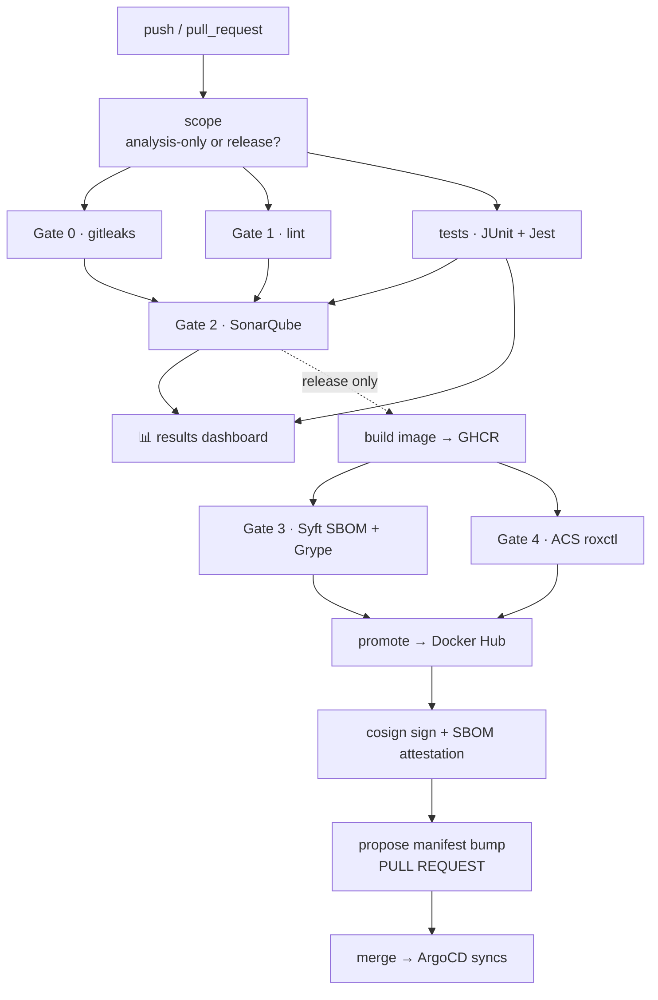

<div align="center">

# opsera-mid_project — CI/CD

**A DevSecOps pipeline: analyse, test, scan, sign, then propose the deploy.**

Every stage is a separate reusable workflow, so each gate is visible — and
individually re-runnable — in the Actions UI.

[](https://github.com/mhmdmstfa2010/opsera-mid_project/actions/workflows/ci.yml)
[](LICENSE)

</div>

---

## Table of contents

- [Pipeline at a glance](#pipeline-at-a-glance)
- [Repository layout](#repository-layout)
- [Branch strategy](#branch-strategy)
- [Results dashboard](#results-dashboard)
- [GitOps delivery](#gitops-delivery)
- [Required secrets and variables](#required-secrets-and-variables)
- [Image signing and verification](#image-signing-and-verification)
- [Running the gates locally](#running-the-gates-locally)
- [Troubleshooting](#troubleshooting)

---

## Pipeline at a glance

`ci.yml` is the only workflow that listens to GitHub events. It calls each
stage as a reusable workflow and wires the order.


```mermaid
flowchart TD
    E["push / pull_request"] --> SC["scope<br/>analysis-only or release?"]
    SC --> G0["Gate 0 · gitleaks"]
    SC --> G1["Gate 1 · lint"]
    SC --> T["tests · JUnit + Jest"]
    G0 --> SQ["Gate 2 · SonarQube"]
    G1 --> SQ
    T --> SQ
    T --> DASH["📊 results dashboard"]
    SQ --> DASH
    SQ -.release only.-> B["build image → GHCR"]
    B --> G3["Gate 3 · Syft SBOM + Grype"]
    B --> G4["Gate 4 · ACS roxctl"]
    G3 --> P["promote → Docker Hub"]
    G4 --> P
    P --> S["cosign sign + SBOM attestation"]
    S --> M["propose manifest bump<br/>PULL REQUEST"]
    M --> ARGO["merge → ArgoCD syncs"]
```

| # | Stage | Tooling | Fails on |
| - | ----- | ------- | -------- |
| 0 | `gitleaks` | gitleaks | any committed secret |
| 1 | `lint` | Hadolint, Checkstyle, ESLint | Dockerfile / Java / JS lint errors |
| — | `test` | JUnit + JaCoCo, Jest + lcov | failing tests |
| 2 | `sonarqube` | scan + Quality Gate | quality gate not `OK` |
| — | `build` | Docker | build error |
| 3 | `sbom-scan` | Syft, Grype | fixable CVEs ≥ `high` |
| 4 | `acs-check` | ACS `roxctl image check` | policy violation |
| — | `promote-dockerhub` | skopeo | Docker Hub copy failure |
| — | `sign` | cosign | signing / attestation failure |
| — | `update-manifest` | GitOps PR | cannot open the PR |

Every stage writes a one-line pass/fail verdict to the run summary and
archives its raw report as an artifact.

### How the image moves between stages

Each job starts on a fresh VM, so an image built in one job does not exist in
the next. `build` therefore stages the image in **GHCR**, and every later
stage logs in and re-pulls it. The stages are wired with `needs` so the gate
order is unchanged, and nothing is promoted out of GHCR, signed, or deployed
until all the gates above it are green.

> The one consequence: the GHCR push happens **before** Grype, because GHCR is
> the hand-off. GHCR is a private staging registry and nothing leaves it until
> every gate passes, so this moves the timing of the pre-push scan, not
> whether it gates promotion, signing and deployment.

---

## Repository layout

```
.github/workflows/
├── ci.yml                        # the only event-triggered workflow
├── gates/
│   ├── 00-gitleaks.yml           # Gate 0
│   ├── 01-lint.yml               # Gate 1
│   ├── 02-test.yml               # unit tests + coverage
│   ├── 03-sonarqube.yml          # Gate 2
│   ├── 04-build.yml              # build → GHCR
│   ├── 05-sbom-grype.yml         # Gate 3
│   ├── 06-acs.yml                # Gate 4
│   ├── 07-promote.yml            # GHCR → Docker Hub
│   └── 08-sign.yml               # cosign
└── reporting/
    ├── test-dashboard.yml        # results dashboard
    └── update-manifest.yml       # GitOps tag bump, as a PR
.ci/
└── dashboard.py                  # parses coverage + SonarQube → run summary
cosign.pub                        # public key for verifying signed images
```

### Adding or changing a stage

Create a new file under `gates/` with `on: workflow_call`, then call it from
`ci.yml`:

```yaml
  my-new-gate:
    name: my gate
    needs: [lint]
    uses: ./.github/workflows/gates/09-my-new-gate.yml
    secrets: inherit
```

Two gotchas worth knowing:

- **Job-level `env:` in the caller is not inherited.** Define `env:` inside
  the called workflow (that is why `GRYPE_SEVERITY_THRESHOLD` lives in
  `05-sbom-grype.yml`, not in `ci.yml`).
- **Called workflows have separate workspaces.** Pass data between them with
  artifacts, not files — the SBOM is uploaded in Gate 3 and downloaded in the
  signing stage for exactly this reason.

---

## Branch strategy

```
feature/*  ──push──▶   analysis gates only — fast feedback, no images
     │
     └── pull request ──▶  main / develop  ──▶  full pipeline
```

| Event | Gates 0–2 + tests + dashboard | Image build, scan, sign, GitOps PR |
| ----- | ---------------------------- | ---------------------------------- |
| push to `feature/*` | ✅ | ❌ |
| pull request → `main` / `develop` | ✅ | ❌ |
| push to `main` / `develop` | ✅ | ✅ |

The decision is made once, by the `scope` job, and exposed as an output that
every release job checks. This is deliberate: **image jobs must never run for
unmerged code**, and the GitOps PR must only ever describe code that is
already on a protected branch.

New commits to the same branch cancel the in-flight run — except on `main`,
where a run is a release and is allowed to finish.

### Protecting the branches

Configure this in **Settings → Branches → Branch protection rules** (not in
the repo files):

- **main** and **develop**
  - Require a pull request before merging
  - Require status checks to pass, selecting the analysis gates
  - Do **not** allow bypassing (so nobody can push straight to `main`)

> **Required-check names changed when the pipeline was split into reusable
> workflows.** Checks are now reported as `<caller job> / <called job>`, e.g.
> `Gate 2 · SonarQube / Gate 2 · SonarQube`. Re-select them in the branch
> protection UI, or a merge can be blocked by checks that no longer exist.

---

## Results dashboard

`📊 results dashboard` renders one page in the run summary with real numbers
from that run:

- **Coverage** — backend line/branch coverage parsed from JaCoCo, frontend
  from lcov, plus an overall figure
- **Gates** — pass/fail for the test and SonarQube jobs and the Quality Gate
- **SonarQube** — coverage, duplicated lines, bugs, vulnerabilities, security
  hotspots and code smells, read live from the Sonar API

Coverage bands follow the usual 80% / 60% thresholds. A component with no
tests is reported as such rather than as `0%`.

The dashboard job runs even when a gate fails, so a red run still shows the
numbers that explain it. GitHub Actions has no streaming widget — "live"
here means the page is generated at the end of the run from that run's own
artifacts and the current SonarQube state, not a static banner.

Preview it locally:

```bash
COVERAGE_DIR=coverage-raw SUMMARY_FILE=/tmp/dash.md \
  PROJECT_KEY=opsera-mid_project python3 .ci/dashboard.py
```

---

## GitOps delivery

CI never talks to the cluster. The final stage clones the manifest repo,
rewrites the two `newTag:` lines, and **opens a pull request** — it does not
push to the default branch.

Merging that PR is what makes ArgoCD sync the new images. A human therefore
sees exactly which image is about to be deployed, and the manifest repo
changes only through review.

- `add-paths` limits the PR to those two files, so no other manifest can be
  modified by a pipeline run.
- Re-running on a newer commit re-points the same branch, so the manifest
  repo never collects a queue of stale bump PRs.
- **Roll back** by reverting the bump commit (or pinning a known-good SHA) —
  ArgoCD syncs the rollback like any other change.

The manifest repo must contain **exactly one** `newTag:` line per component
`kustomization.yaml`; the rewrite is a `sed` over that line.

---

## Required secrets and variables

**Settings → Secrets and variables → Actions**

| Secret | Used by | Notes |
| ------ | ------- | ----- |
| `SONAR_TOKEN` | Gate 2, dashboard | analysis token from SonarQube |
| `SONAR_HOST_URL` | Gate 2, dashboard | e.g. `https://your-sonar.example.com` |
| `DOCKERHUB_USERNAME` | promote, sign | |
| `DOCKERHUB_TOKEN` | promote, sign | |
| `ROX_CENTRAL_ENDPOINT` | Gate 4 | ACS Central address |
| `ROX_API_TOKEN` | Gate 4 | ACS API token |
| `COSIGN_PASSWORD` | sign | private key passphrase |
| `COSIGN_PRIVATE_KEY` | sign | PEM private key |
| `MANIFEST_REPO_TOKEN` | update-manifest | see below |

**Variables:** `DOCKERHUB_NAMESPACE` (your Docker Hub namespace) and
`MANIFEST_REPO` (`owner/name` of the GitOps repo — accepted as either a
Variable or a Secret).

### `MANIFEST_REPO_TOKEN`

Since the manifest update is now a pull request, the fine-grained PAT needs
**more scope than before**:

| Permission | Access | Why |
| ---------- | ------ | --- |
| Contents | Read & write | create the branch, push the commit |
| Pull requests | Read & write | open the PR |

Granted on the **manifest repo only**. A token missing the pull-request scope
still clones and commits fine, then fails when opening the PR — the stage
names that cause explicitly.

---

## Image signing and verification

Images are signed with cosign and carry a CycloneDX SBOM attestation. The
**public** key is committed here as [`cosign.pub`](cosign.pub):

```bash
cosign verify --key cosign.pub \
  docker.io/$DOCKERHUB_NAMESPACE/frontend:<git-sha>

# and the SBOM attestation
cosign verify-attestation --key cosign.pub \
  docker.io/$DOCKERHUB_NAMESPACE/frontend:<git-sha>
```

`cosign.pub` is public key material and is *meant* to be readable — it is
what makes verification possible for anyone. Only `COSIGN_PRIVATE_KEY` is
secret, and it lives in GitHub secrets, never in a repository. The pair must
be kept together: the private key's public half must match this file, or
verification fails with a key mismatch.

For a deployment pinned to an exact artifact, prefer the digest over the tag:

```bash
docker buildx imagetools inspect \
  docker.io/$DOCKERHUB_NAMESPACE/frontend:<git-sha> --format '{{.Manifest.Digest}}'
```

---

## Running the gates locally

```bash
# Gate 0 — secrets
docker run --rm -v "$PWD:/repo" -w /repo zricethezav/gitleaks:latest detect --source . --no-banner

# Gate 1 — lint
./backend/mvnw -B checkstyle:check          # Google style
cd frontend && npm ci && npm run lint       # ESLint
docker run --rm -i -v "$PWD/frontend:/f" hadolint/hadolint:latest hadolint -f /f/Dockerfile

# tests + the coverage artifacts the dashboard reads
cd backend  && ./mvnw -B test                # → target/site/jacoco/jacoco.xml
cd frontend && npm test -- --coverage --watchAll=false --passWithNoTests
```

> The frontend currently has no test files, so `--passWithNoTests` keeps CI
> green and the dashboard reports the frontend as untested rather than 0%.

---

## Troubleshooting

| Symptom | Fix |
| ------- | --- |
| `npm test` → *"No tests found"* (exit 1) | expected locally; CI passes `--passWithNoTests` |
| `checkstyle:check` reports the default checks | run from `backend/`, where `pom.xml` pins Google style |
| SonarQube scan fails on coverage | run `./mvnw test` first so `jacoco.xml` exists |
| SonarQube 403 on `project_status` | the tunnel is dead, not the token — the Gate 2 reachability check exists for this |
| A reusable-workflow stage cannot see an `env:` var | define it inside the called workflow; caller `env:` is not inherited |
| SBOM missing at the signing stage | it crosses jobs as an artifact, not a file |
| Manifest stage fails only at the PR step | `MANIFEST_REPO_TOKEN` needs Pull requests: Read & write |
| Branch protection blocks a merge | re-select the required checks; the names changed when the pipeline was modularised |

<details>
<summary><b>Local SonarQube for CI development</b></summary>

```bash
docker run -d --name sonarqube -p 9000:9000 --restart unless-stopped sonarqube:community
# open http://localhost:9000 (admin/admin, password rotated on first login)
# create the project "opsera-mid_project", generate an analysis token
```

Point the pipeline at it through a tunnel, then set `SONAR_HOST_URL` to the
tunnel URL and `SONAR_TOKEN` to the analysis token. The URL changes on every
restart unless you reserve a static domain.

</details>

---

## License

MIT — see [LICENSE](LICENSE).
