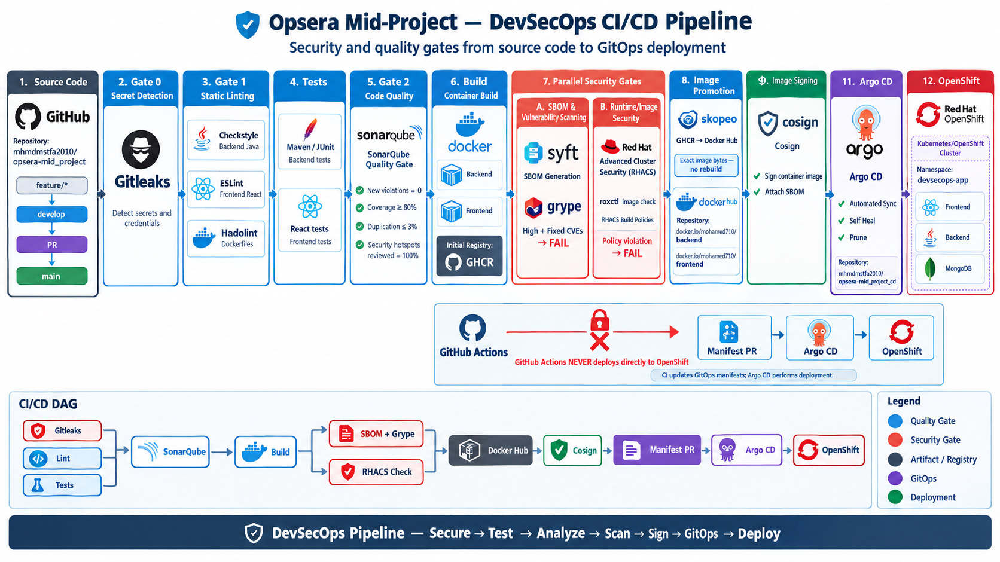
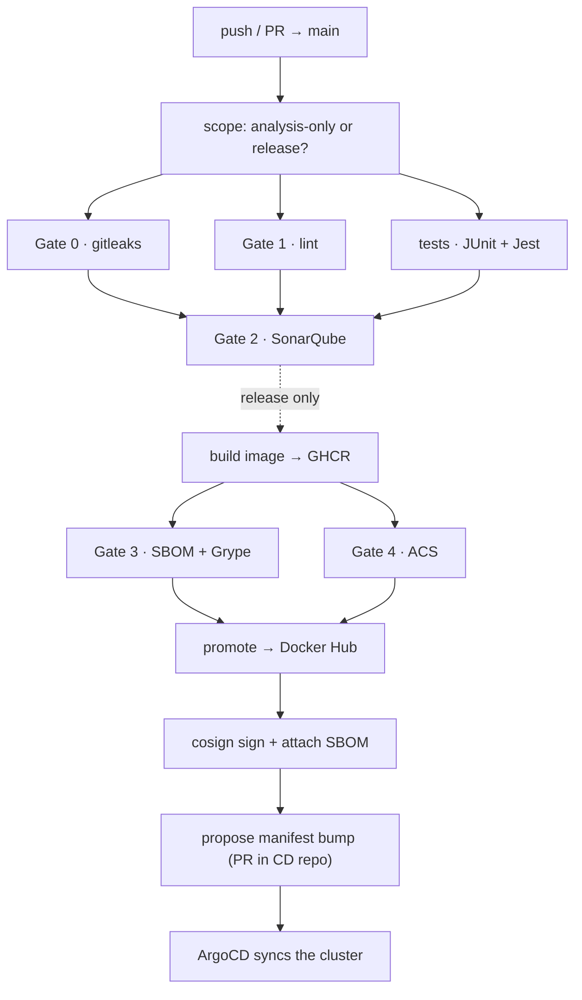

# Project Context Prompt — `opsera-mid_project`

> **How to use this:** paste this whole document at the start of a new session
> with an AI assistant working on this repository. It is written to be
> self-contained — it does not assume any prior conversation. Every command,
> path, and credential below reflects the repository's real state.
>
> **Verify before trusting.** Line numbers and exact CLI output can drift as
> the repo changes. Re-read the referenced files before editing them.

---

## 1. What this project is

A **DevSecOps CI/CD pipeline** for a small student-management application,
built as an academic/portfolio exercise. The application is incidental; the
deliverable is the *pipeline*: every stage is a security or quality gate that
must pass before an image is promoted, signed, and proposed for deployment.

Two repositories:

| Repo | Role |
|---|---|
| `mhmdmstfa2010/opsera-mid_project` | The app + the pipeline (this repo) |
| `mhmdmstfa2010/opsera-mid_project_cd` | GitOps manifests. ArgoCD watches it and syncs the cluster. |

The pipeline **never touches the OpenShift cluster directly**. It only edits a
manifest file in the CD repo; ArgoCD does the actual deployment. That separation
is intentional and should be preserved.

---

## 2. The application

A two-tier student service. Small on purpose — the point is the delivery
pipeline, not the feature set.

### Backend — `backend/`

- **Spring Boot 3.5.16**, **Java 17** (Boot 3.x *requires* 17+)
- Package `com.sliit.cc.studentservice`
- Layers: `controller` / `service` + `service.impl` / `repository` / `entity` / `util`
- `StudentRestController` + `StudentServiceImpl` + `StudentRepository` (MongoDB)
- Also pulls in `spring-boot-starter-data-mongodb`
- Built by Maven wrapper (`./mvnw`) — no local JDK install needed

API surface (used by the frontend and by the local e2e checks):

```
GET  /student/all       → 200  list of students
POST /student/new       → 201  {"id":"IT9999"}     (created record)
GET  /student/id/IT9999 → 200  the created record
```

### Frontend — `frontend/`

- **React 17**, built by **react-scripts 4.0.3** (CRA)
- `App.js`, `components/`, `api/` (axios `^0.24.0`)
- Tests: `App.test.js`, `reportWebVitals.test.js`; run with `--passWithNoTests`
- Checkstyle config: `google_checks.xml`

> **Known follow-up (not yet done):** `axios@0.24.0` has its own advisories.
> It is bundled by `react-scripts`, so it is invisible to the image scanner and
> never blocks a gate. Worth bumping deliberately, and worth noting that the
> scanner *cannot* protect you here — only a dependency audit will.

---

## 3. The pipeline architecture

### 3.1 One entry point, ten reusable stages

`ci.yml` is the **only** workflow that listens to GitHub events. It calls each
stage via `workflow_call` and wires the dependency graph. Every gate is
therefore a separate workflow file with its own name, its own check in the UI,
and the ability to be re-run on its own.

```
.github/workflows/
  ci.yml                    orchestrator — the ONLY event-triggered workflow
  gate-0-gitleaks.yml       Gate 0 · gitleaks
  gate-1-lint.yml           Gate 1 · lint
  tests.yml                 tests · JUnit + Jest
  gate-2-sonarqube.yml      Gate 2 · SonarQube
  build.yml                 build image → GHCR
  gate-3-sbom-grype.yml     Gate 3 · SBOM + Grype
  gate-4-acs.yml            Gate 4 · ACS (Red Hat Advanced Container Security)
  promote.yml               promote to Docker Hub
  sign.yml                  cosign sign + attach SBOM
  update-manifest.yml       propose manifest bump (opens a PR in the CD repo)
```

### 3.2 Triggers and branch strategy

`ci.yml` triggers **only on**:

```yaml
on:
  pull_request:
    branches: [main]
  push:
    branches: [main]
```

**`main` is the only branch CI responds to.** Pushing to `develop` triggers
nothing.

Branching model:

```
feature/* ──► develop ──► pull request ──► main
```

Feature branches merge into `develop`; `develop` reaches `main` through a PR.
`develop` exists mostly so that documentation/CHANGELOG style commits can carry
`[skip ci]` and land without burning a full pipeline run.

> **Operational gotcha, learned the hard way:** if you need to test a change in
> CI, it must land on `main`. A push to `develop` is silent. Also, local
> `main` drifts far behind — always `git pull --ff-only origin main` before
> pushing, and never force-push.

### 3.3 The DAG





> The image is the authoritative overview. The mermaid diagram is kept because
> it renders in a terminal and survives where the PNG may not. **If the two ever
> disagree, the workflow files are the source of truth** — `ci.yml`'s `needs:`
> graph, not either diagram.

Concrete `needs:` wiring in `ci.yml`:

| Job | Needs |
|---|---|
| `gitleaks` | — |
| `lint` | — |
| `test` | — |
| `sonarqube` | gitleaks, lint, test |
| `build` | sonarqube |
| `sbom-scan` | build |
| `acs-check` | build |
| `promote-dockerhub` | sbom-scan, acs-check |
| `sign` | promote-dockerhub |
| `update-manifest` | sign |

Note `sbom-scan` and `acs-check` run in **parallel** (both need only `build`),
and `promote-dockerhub` waits for **both**. Gates 3 and 4 scan the same image by
two independent scanners.

---

## 4. Stage by stage

### Gate 0 · gitleaks — secret scanning
Scans the full history and working tree for committed credentials. Fails the
build on any finding. Runs alongside a **pre-commit hook** locally so secrets
never reach a commit in the first place.

### Gate 1 · lint
- **Backend:** Checkstyle against `google_checks.xml`
- **Frontend:** ESLint via react-scripts
- **Docker:** hadolint via `hadolint-action@v3.5.0`
  (`.hadolint.yaml` sets `threshold: warning` and ignores `DL3018`)

### tests · JUnit + Jest
- **Backend:** `./mvnw -B test`
- **Frontend:** `npm test -- --passWithNoTests` (CRA would otherwise exit
  non-zero with zero test files)
- **`typescript` pinned to `4.9.5`** via npm `overrides` — without this,
  react-scripts 4 fails type-resolution on modern Node
- Uploads a `coverage-raw/` artifact consumed downstream by Gate 2

### Gate 2 · SonarQube
Quality gate over `backend/src` and `frontend/src`.

Two steps that exist specifically because of past failures:

1. **`Normalise SONAR_HOST_URL`** — GitHub secrets frequently carry stray
   leading/trailing whitespace. The scanner tolerates it; the quality-gate
   action builds a URL with `curl` and dies with
   `curl: (3) URL rejected: Malformed input`. Whitespace is stripped once, here.
2. **`Verify SonarQube reachability and token`** — fails fast and loudly.
   *Why:* a tunnel provider that blocks traffic returns **HTTP 403**, and
   sonar-scanner reports that as *"You're not authorized to analyze this
   project"* — indistinguishable from a bad token. This cost hours of
   misdiagnosis before the check was added. It now names the real cause.

SonarQube parameters:

```
-Dsonar.projectKey=opsera-mid_project
-Dsonar.sources=backend/src,frontend/src
-Dsonar.java.binaries=backend/target/classes
-Dsonar.coverage.jacoco.xmlReportPaths=coverage-raw/backend/target/site/jacoco/jacoco.xml
-Dsonar.javascript.lcov.reportPaths=coverage-raw/frontend/coverage/lcov.info
```

`sonar.java.binaries` points at `backend/target/classes`, so this job compiles
the backend itself — the `tests` job's runner no longer exists by now.

**Quality gate in use:** built-in **"Sonar way"**, `PREVIOUS_VERSION` mode:

| Metric | Rule |
|---|---|
| `new_violations` | 0 |
| `new_coverage` | ≥ 80% |
| `new_duplicated_lines_density` | ≤ 3% |
| `new_security_hotspots_reviewed` | 100% |

Because it is a built-in default, a fresh SonarQube instance gets it
automatically — nothing to replicate on migration.

### build → GHCR
Multi-stage builds. No JDK or Node on the host is required.

- **`backend/Dockerfile`** — `maven:3.9-eclipse-temurin-17` compiles the fat
  JAR; runtime `eclipse-temurin:17-jre-alpine`; `apk upgrade --no-cache`
- **`frontend/Dockerfile`** — `node:20-alpine` builds the static site;
  runtime `nginx:alpine` serving on **:3000** with SPA fallback
  (`frontend/nginx.conf`). No `node_modules` in the runtime image.

POM overrides exist to keep transitive deps current:
`tomcat.version=10.1.60`, `jackson-bom.version=2.21.5`,
`log4j2.version=2.25.5`, jettison `1.5.7`.

Images are staged to **GHCR** first, because Gate 4 (ACS) needs a registry
reference to query — it reads image metadata from a registry rather than local
layers.

### Gate 3 · SBOM + Grype
Syft generates a CycloneDX SBOM from the built image; Grype scans it.

```yaml
anchore/sbom-action@v0      # SBOM
anchore/scan-action@v7      # Grype
  severity-cutoff: high
  only-fixed: true
  fail-build: true
```

**`only-fixed: true` is a deliberate policy decision.** It blocks only on
High+ CVEs that have a published fix. Findings with no upstream patch (typical
for `tiff`/`zlib`) are still written to the JSON/SARIF artifact but do not fail
the build — a red build nobody can action teaches people to ignore red.

### Gate 4 · ACS (Red Hat Advanced Container Security)
```yaml
curl -sSL -o roxctl "https://mirror.openshift.com/pub/rhacs/assets/4.11.4/bin/Linux/roxctl"
roxctl image check --image="$GHCR_IMAGE" --output json > acs-check-$COMPONENT.json
```
Auth via environment, **not** flags:
```yaml
ROX_ENDPOINT: ${{ secrets.ROX_CENTRAL_ENDPOINT }}
ROX_API_TOKEN: ${{ secrets.ROX_API_TOKEN }}
ROX_INSECURE_CLIENT_SKIP_TLS_VERIFY: "true"
```

**Prerequisite:** a GHCR image integration must already exist in ACS Central, or
this fails with *"no matching image registries found"*.

**How violations are counted — read this before trusting a green result.**
The gate deliberately **does not trust `roxctl`'s exit code**. It parses
`policyViolations` out of the report JSON across several possible shapes:

```
.reports[]?.scan.results.policyViolations[]?
.reports[]?.scan.summary.policyViolations[]?
.reports[]?.results.policyViolations[]?
.policyViolations[]?
```

and fails if the count is non-zero. Consequence: a policy set to **`Inform`**
(audit-only) — where `roxctl` exits `0` because nothing is enforcing — still
fails the gate. ACS decides what counts as a violation; this gate decides
whether to block on it. Those are deliberately separate.

> **Residual weakness to be aware of:** if Central returns a report with *no*
> `policyViolations` key at all — as opposed to an empty list — the count
> resolves empty and `roxctl` exit `0` yields a green pass. That state is
> indistinguishable from a genuinely clean scan, and it is the normal state
> when **no GHCR image integration is configured**: the image is never
> resolved, the policy criteria never matches, and "policy did not run" looks
> exactly like "policy passed". Confirm the integration exists before
> concluding that any policy is working.

### promote → Docker Hub
`skopeo` copies the **exact bytes that passed every gate** from GHCR to
Docker Hub. No rebuild — the artifact scanned is byte-identical to the one
deployed.

```yaml
docker run --rm quay.io/skopeo/stable copy \
  --src-creds  "${{ github.actor }}:${{ secrets.GITHUB_TOKEN }}" \
  --dest-creds "${{ secrets.DOCKERHUB_USERNAME }}:${{ secrets.DOCKERHUB_TOKEN }}" \
  "docker://${{ steps.push-ghcr.outputs.ghcr_image }}" \
  "docker://docker.io/${{ vars.DOCKERHUB_NAMESPACE }}/${{ matrix.component }}:${{ github.sha }}"
```

> `quay.io/skopeo/stable` is pulled only as a **tool container**. The app
> images live on **Docker Hub** — a mentor-approved deviation from the original
> brief, which named Quay.

### sign — cosign
```bash
echo "$DOCKERHUB_TOKEN" | docker login docker.io -u "$DOCKERHUB_USERNAME" --password-stdin
printf '%s\n' "$COSIGN_PRIVATE_KEY" > cosign.key
cosign sign --key cosign.key --yes "$IMAGE"
cosign attach sbom --sbom "sbom-$COMPONENT.json" "$IMAGE"
rm -f cosign.key
docker logout docker.io
```

Details that matter:
- Auth is **ambient** (Docker config), not `--registry-creds` — removed in cosign 2.x
- `printf` not `echo` — a secret with a trailing newline would corrupt the PEM
- The token never enters `argv`, so it cannot leak via the process list
- Key is a cosign **encrypted PKCS#8** key; `COSIGN_PASSWORD` is its passphrase
- `cosign.pub` is **gitignored and untracked** — it was previously committed,
  which silently defeats a `.gitignore` entry (git only ignores *untracked*
  paths). Fixed with `git rm --cached`.

### propose manifest bump (Gate 7)
Opens a **PR** in the CD repo rather than pushing directly — CI does not write
to `main` of another repo.

Each overlay kustomization must contain **exactly one** `newTag:` line, which
the pipeline rewrites with `sed`:

```yaml
# overlays/production/backend/kustomization.yaml
images:
  - name: backend
    newName: docker.io/mohamed710/backend
    newTag: 0.0.1      # CI rewrites this line
```

The `MANIFEST_REPO` slug is read defensively, because GitHub keeps **Variables
and Secrets on separate tabs** and a slug stored in the wrong one silently
expands to an empty string:

```yaml
MANIFEST_REPO: ${{ vars.MANIFEST_REPO || secrets.MANIFEST_REPO }}
```

---

## 5. Infrastructure

### SonarQube on EC2

| | |
|---|---|
| Host | `ec2-34-230-188-247.compute-1.amazonaws.com` (RHEL 10.2, x86_64) |
| Public URL | `https://34.230.188.247` |
| Container | `sonarsource/sonarqube:community`, podman, `--restart=unless-stopped` |
| Binding | `127.0.0.1:9000` — loopback only, **never** in the security group |
| Login | `admin` (password rotated from the default `admin/admin`) |
| Memory | `-Xmx1500m` (box has 3.5 GB total) |

**TLS is real, not self-signed.** nginx terminates HTTPS with a **Let's Encrypt
certificate issued for the IP address** — no domain required. That became
possible when Let's Encrypt opened IP certificates (GA 15 Jan 2026, `shortlived`
profile, ~160 h lifetime). Certbot needs **≥ 5.3** for `--ip-address`; RHEL 10's
EPEL ships 4.2.0, so certbot was installed from pip (5.8.0).

Renewal is automatic via `certbot-renew.timer`, checked twice daily; a dry run
passes. With a 160-hour lifetime this is **mandatory**, not optional.

```bash
sudo /usr/local/bin/certbot renew --dry-run --preferred-profile shortlived
```

SELinux required explicit configuration — without it, nginx returns 403 on
every proxied request and on the ACME challenge path:

```bash
sudo setsebool -P httpd_can_network_connect 1
sudo semanage fcontext -a -t httpd_sys_content_t "/var/www/certbot(/.*)?"
sudo restorecon -Rv /var/www/certbot
sudo semanage fcontext -a -t container_file_t "/opt/sonarqube(/.*)?"
```

> **Known weaknesses, unaddressed:**
> - `firewalld` is **inactive** and `iptables` is **empty** — the AWS security
>   group is the only firewall. It is configured correctly (443 open, 9000
>   blocked, 22 open), but there is no host-level defence.
> - Memory sat at ~462 Mi free of 3.5 Gi. It survived real scans, but headroom
>   is thin; lower the heaps if scans become flaky.
> - SSH port 22 open to `0.0.0.0/0`. Restrict to a `/32`.
> - Podman, not Docker — image references are `docker.io/library/sonarqube:community`
>   after load, which does not match `docker.io/sonarsource/sonarqube`. Tag it
>   explicitly before running, or podman re-attempts a (rate-limited) pull.

### Docker Hub images
Namespace **`mohamed710`**: `mohamed710/backend`, `mohamed710/frontend`, tagged
with the full commit SHA.

---

## 6. Secrets and variables

### Secrets
| Name | Purpose |
|---|---|
| `SONAR_HOST_URL` | `https://34.230.188.247` |
| `SONAR_TOKEN` | SonarQube analysis token |
| `DOCKERHUB_USERNAME` / `DOCKERHUB_TOKEN` | promote + sign |
| `ROX_CENTRAL_ENDPOINT` / `ROX_API_TOKEN` | Gate 4 |
| `COSIGN_PASSWORD` / `COSIGN_PRIVATE_KEY` | signing |
| `MANIFEST_REPO_TOKEN` | clone + push in the CD repo (**write** scope) |

### Variables
| Name | Value |
|---|---|
| `DOCKERHUB_NAMESPACE` | `mohamed710` |
| `MANIFEST_REPO` | `mhmdmstfa2010/opsera-mid_project_cd` |

> **The Variables/Secrets trap.** Both live under *Settings → Secrets and
> variables → Actions*, on **separate tabs**. The pipeline reads
> `vars.MANIFEST_REPO` with a `secrets.` fallback because a slug saved as a
> secret otherwise expands to an empty string and produces the misleading
> `fatal: repository 'https://github.com/.git/' not found`. Always store a
> non-sensitive value like this as a **Variable**.

---

## 7. The recurring lesson: pin your tools

**Every hard failure after the pipeline first went green was a tool changing
underneath an unpinned install — not a defect in the code or images.**

| Tool | Symptom | Fix |
|---|---|---|
| `anchore/scan-action@v4` | Pins Grype 0.80.0, which reads only the grype-db **schema v5** feed. That schema hit EOL 2026-03-06, so it fetched a ~28-week-old DB, Grype rejected it, and scan-action reported **"Found vulnerabilities with level 'high' or higher"** — a phantom result on clean images | → `@v7` (Grype 0.110, live DB) |
| `roxctl` from `.../assets/latest/` | Shipped 4.11.4, which **removed `--token`** → `unknown flag: --token` | env-var auth + pin **4.11.4** |
| Docker Scout from `main/install.sh` | Renamed `--ignore-unfixed` → `--only-fixed` | new flag + explicit install path + print version |
| `cosign` 2.5.2 | Removed `--registry-creds` | ambient Docker config via `docker login` |
| `MANIFEST_REPO` | Set in Secrets, read from `vars.` | `vars \|\| secrets` fallback |

**Rules that follow:**
1. Pin every CLI to an explicit version. Never `latest`.
2. When installing grype/roxctl/scout via a vendor script, **pass the tag
   explicitly** — Anchore's and Docker's install scripts ignore the version in
   the URL and fetch the newest release unless a tag argument is supplied.
3. Before changing a flag, test it against the real binary. Four of these were
   diagnosed by running the tool locally, not by reading docs.
4. Print tool versions in the log (`grype db status`, `docker scout version`,
   `roxctl version`) so drift is visible rather than mysterious.
5. A `.gitignore` entry does **nothing** for an already-tracked file. Verify
   with `git check-ignore -v <path>`, not by reading the file.

---

## 8. Operational runbook

### Run the gates locally
No JDK/Node needed — Dockerfiles compile inside the image.

```bash
# Backend
docker build -t backend:local ./backend

# Frontend
docker build -t frontend:local ./frontend

# Grype (use a CURRENT grype; ≥0.100 for the live DB)
grype docker:backend:local --fail-on high --only-fixed
grype docker:frontend:local --fail-on high --only-fixed

# hadolint
docker run --rm -i hadolint/hadolint < backend/Dockerfile
```

### Verify SonarQube locally
```bash
curl -s http://localhost:9000/api/system/status          # {"status":"UP"}
curl -s -H "Authorization: Bearer $TOKEN" \
     http://localhost:9000/api/authentication/validate   # {"valid":true}
curl -s -H "Authorization: Bearer $TOKEN" \
     "http://localhost:9000/api/projects/search"         # project + lastAnalysisDate
```

### Verify the EC2 SonarQube end to end
```bash
curl -sS https://34.230.188.247/api/system/status
curl -sS -o /dev/null -w '%{ssl_verify_result}\n' https://34.230.188.247/   # 0 = valid
ssh -i ~/Downloads/quay.pem ec2-user@ec2-34-230-188-247.compute-1.amazonaws.com \
  'sudo podman ps; systemctl list-timers certbot-renew.timer'
```

### Inspect a gate that failed
```bash
# per-job verdicts
curl -sS -H "Authorization: Bearer $GH_PAT" \
  "https://api.github.com/repos/mhmdmstfa2010/opsera-mid_project/actions/runs/<run>/jobs" \
  | python3 -c "import json,sys;[print(j['conclusion'],j['name']) for j in json.load(sys.stdin)['jobs']]"

# full log for one job
curl -sSL -H "Authorization: Bearer $GH_PAT" \
  "https://api.github.com/repos/mhmdmstfa2010/opsera-mid_project/actions/jobs/<job>/logs" \
  -o job.log
sed 's/\x1b\[[0-9;]*m//g' job.log | grep -nE "### |❌|violations="
```

> Logs require `Authorization: Bearer <PAT>`. A fine-grained PAT cannot read or
> write Actions secrets — those must be set through the web UI.

### Host caveats
- `sudo` needs no password on the EC2
- No AWS CLI or `~/.aws` credentials locally; EC2 access is by SSH key only
- Tools in `~/.local/bin`: `ngrok`, `kustomize` (v5.4.3), `grype`, `cloudflared`
- **`/tmp` is periodically reaped, and the host has restarted mid-session** —
  do not park long-lived or uncommitted work there. Copy anything you want to
  keep into the repo and commit it.
- `docker save` piped into a `| tail` pipe silently produced nothing; write to
  disk first, then transfer.

---

## 9. Current status

**All seven gates have passed together.** Verified run `36003590257`
(`e760ef6`) — gitleaks, lint, test, sonarqube, SBOM+Grype, ACS, promote, cosign,
manifest bump. The CD repo received
`bump backend+frontend to e760ef6651cacb3118e61c06247f041a0f94cc21` with both
kustomizations pointing at the exact signed images.

**Gate 4 ACS policy enforcement — proven.** An audit-only policy (`Inform`,
severity Critical, criteria `Image name is: ghcr.io/mhmdmstfa2010/backend`,
lifecycle stage Build) was created in ACS Central and verified:

| | Before policy | After policy |
|---|---|---|
| `roxctl` exit code | `0` | `1` |
| Gate 4 (backend) | passed | **failed** |

The frontend matrix leg still passed, correctly — the policy names only
`backend`. Downstream (`promote`, `cosign`, `propose manifest bump`) was
skipped, so the blast radius was contained: nothing promoted, nothing signed,
no manifest PR. **This test rule still blocks every run until it is deleted or
narrowed.**

---

## 10. Open items

**Security — act on these**
1. `firewalld` is inactive; enable it (the security group is the only firewall)
2. Restrict SSH (port 22) to the operator's IP `/32`
3. Rotate credentials that appeared in chat/logs: the SonarQube admin password
   and the GitHub PAT
4. Delete the fine-grained PAT once unused

**Correctness**
5. Bump `axios@0.24.0` — invisible to the image scanner, needs a dependency audit
6. Lower SonarQube heaps if scans become flaky (only ~462 Mi spare of 3.5 Gi)
7. Consider a named Cloudflare tunnel or a ~$10/yr domain: the current IP cert
   changes on EC2 replacement and expires every ~6.7 days

**Pipeline**
8. Close the Gate 4 "no `policyViolations` key at all" gap — distinguish
   "policy did not run" from "policy passed"
9. Verify a GHCR image integration exists in ACS Central, so policies match
   real image data rather than silently no-op'ing